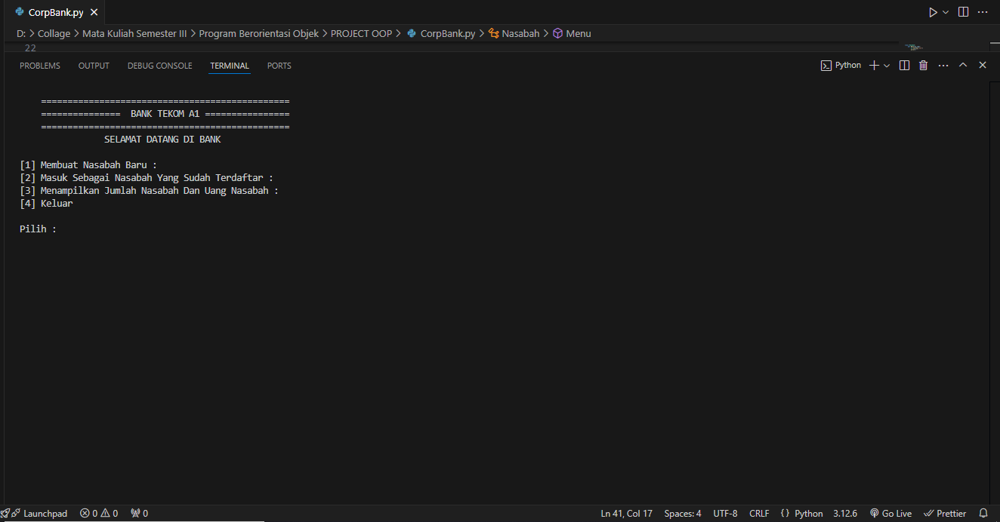
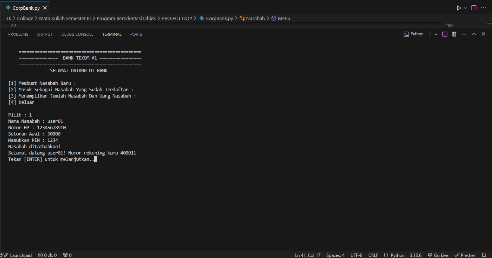

# 🧠   Deskripsi Project 
Sistem Perbankan ini merupakan projek sederhana yang menggunakan bahasa pemrograman python sistem ini memiliki fitur yang biasanya ditemukan pada bank yang ada di dunia nyata seperti mendaftar nasabah baru, melakukan penarikan serta melakukan transfer kepada sesama nasabah. kamu bisa menggunakan program ini untuk kebutuhan seperti tugas sekolah dan lain sebagainya serta kamu bisa memodifikasi sesuai dengan keinginan mu.

# Bahasa Pemrograman 
🐍 **Python**    

## 🚀 Tutorial 

1. Download script program
2. Jalankan script program menggunakan text editor (sesuaikan dengan text editor yang kamu miliki) 
3. selamat menggunakan 🙌

## 🖥️ Program Preview 
1. Tampilan Menu Utama

2. Pendaftaran Nasabah

