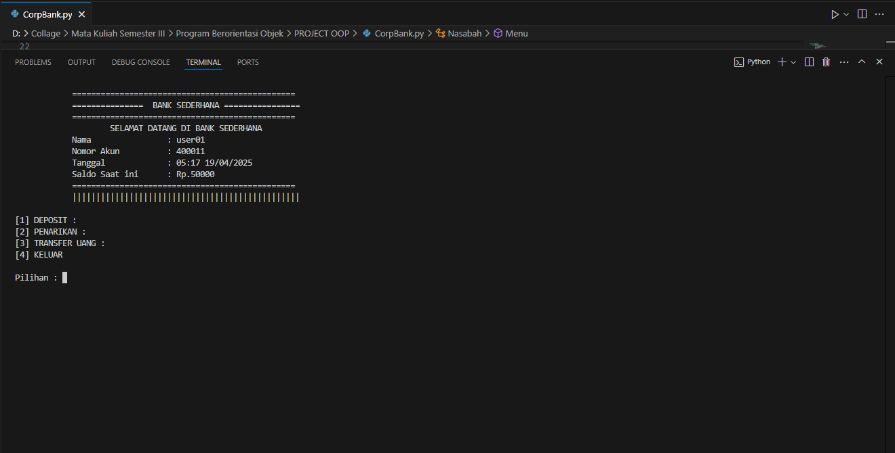
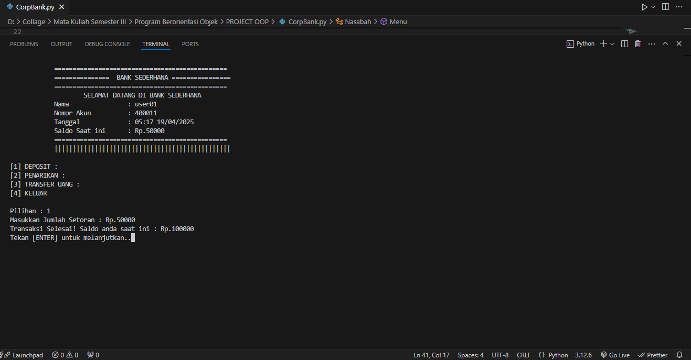
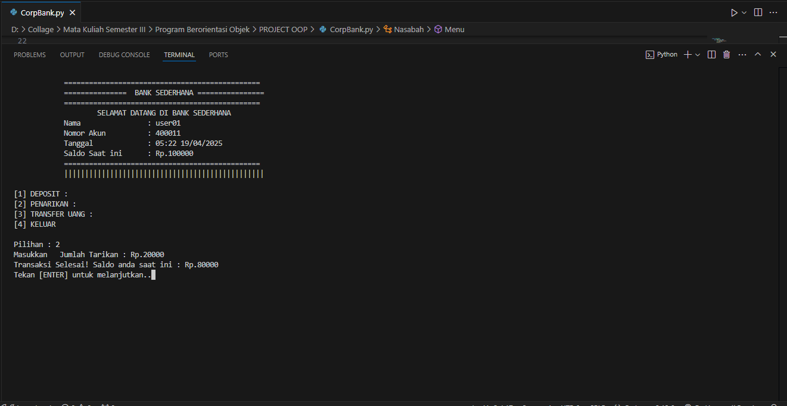
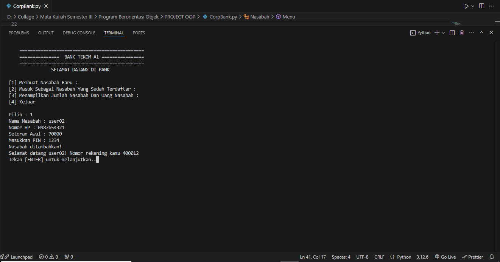
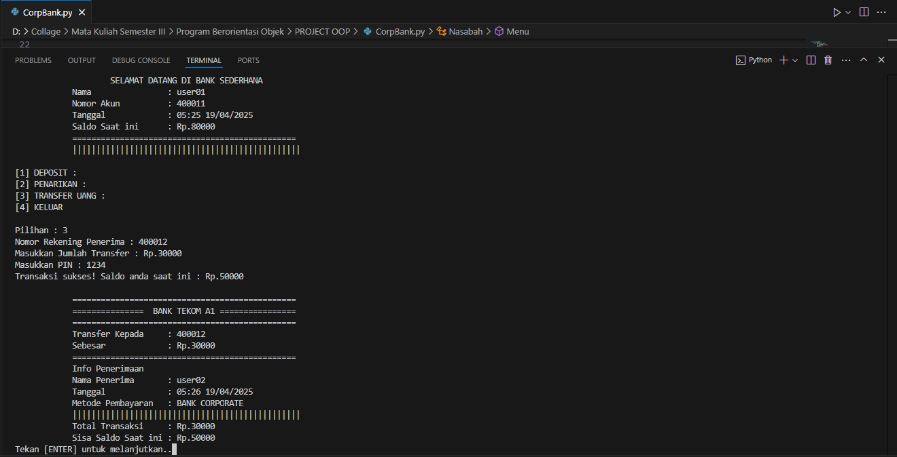
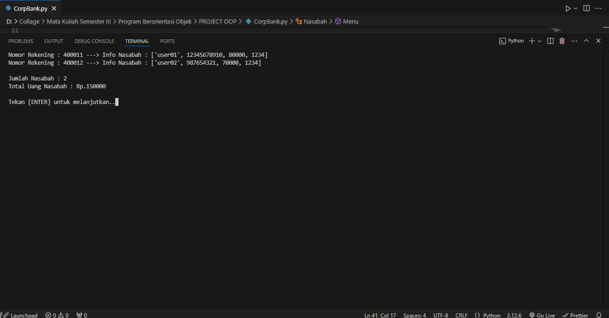
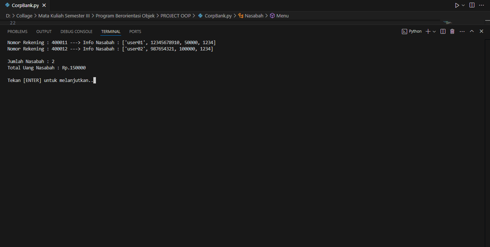

# 🏦 Sistem Perbankan Sederhana dengan Python
Proyek ini merupakan simulasi sistem perbankan sederhana yang dibangun menggunakan bahasa pemrograman Python. Sistem ini memungkinkan pengguna untuk melakukan berbagai operasi perbankan dasar seperti menabung, menarik uang, transfer antar nasabah, hingga pendaftaran nasabah baru dengan kode PIN otomatis.. kamu bisa menggunakan program ini untuk kebutuhan seperti tugas sekolah dan lain sebagainya serta kamu bisa memodifikasi sesuai dengan keinginan mu 👍.

# Bahasa Pemrograman 
🐍 **Python**    

## 🔑 Fitur Utama
1. 📥 Menabung: Tambahkan saldo ke rekening nasabah.
2. 💸 Penarikan: Ambil uang dari saldo dengan validasi PIN.
3. 🔄 Transfer antar nasabah: Kirim saldo ke nasabah lain dalam sistem.
4. 🧾 Daftar Nasabah Baru: Tambah nasabah baru dengan nama, nomor rekening otomatis, dan PIN unik yang di-generate sistem.
5. 🔐 Validasi PIN: Setiap transaksi yang melibatkan saldo dilindungi oleh kode PIN.
6. 📋 Tampilan daftar nasabah dan saldo: Informasi detail seluruh nasabah dapat ditampilkan

## 🖥️ Program Preview 
1. Tampilan Menu Utama

2. Pendaftaran Nasabah

3. Fitur Bank

4. Fitur Nabung

5. Fitur Penarikan

6. Menambahkan Nasabah Baru

7. Fitur Transfer Sesama Nasabah Menggunakan Kode Rekening Bank

8. List Untuk Melihat Daftar Nasabah Yang Terdaftar

9. Keluar Program

